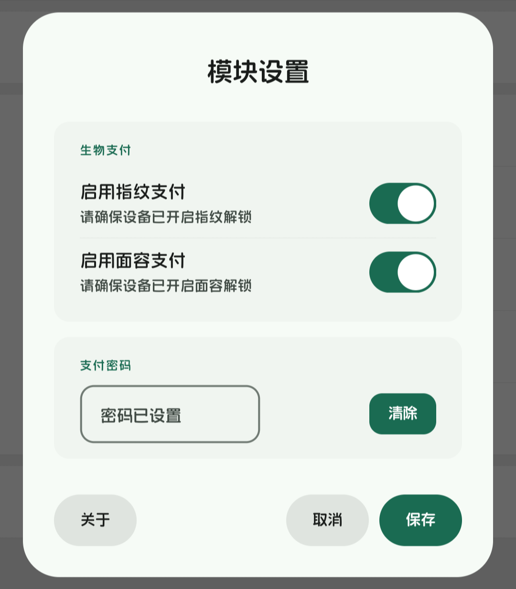

<div align="center">


<h1>BioPay</h1>

<p>为支付应用开启原生般的生物识别认证体验</p>
<p>Native-like biometric payment for WeChat, via LSPosed</p>

[](https://github.com/kiriashi/BioPay/releases)
[](https://github.com/kiriashi/BioPay/actions)
[](LICENSE)
[](https://developer.android.com)
[](https://kotlinlang.org)
[](https://github.com/LSPosed/LSPosed)

[简体中文](README.md) | [English](README_EN.md)

</div>

## 项目简介

当微信官方在部分设备上不提供指纹／面容支付时，每次付款都要手动输入 6 位密码；而一加等 TEE 不可信设备还会因安全锁弹出“系统错误”类提示，打断支付流程。

**BioPay** 是基于 LSPosed（LibXposed API 102）的微信生物支付模块：指纹／面容验证通过后自动完成密码输入，弱面容老设备也能用，体验接近原生。

## 界面预览

<p align="center">
  
</p>

## 功能特性

```
┌───────────────────────────────────────────────┐
│                    BioPay                     │
│         微信原生般的生物识别支付体验          │
└───────────────────────────────────────────────┘
        │               │               │
        ▼               ▼               ▼
 【生物认证与输入】  【键盘感知与切换】    【设置与存储】           
 • 指纹／面容双通道  • 支付键盘弹出即验证  • 长按“设置”唤起设置页   
 • 弱面容兼容模式    • 高斯延迟模拟触摸    • AES-GCM 加密存 Keystore
 • 音量键快速重唤起  • 失败／取消落回键盘  • 调试日志默认关闭       
```

- 指纹支付与面容支付双通道，弱面容兼容模式让更多 Android 9.0+ 设备可用。
- 微信内付款、外部 App 调起的微信支付流程均可覆盖。
- 音量键快速重新唤起生物识别，键盘状态下无需点按即可验证。
- `我 → 设置 → 长按“设置”`唤起模块设置页，在设置页录入 6 位支付密码并选择生物方式。

## 系统架构

模块按职责分为 6 个包，依赖单向向下，`core` 零项目依赖：

| 包 | 职责 |
|---|---|
| `entry` | Xposed 入口 `BioPayModule`＋组合根 `AppWiring`＋生命周期回调 |
| `payment` | 生物支付特性：编排器、认证门、自动输入、键盘遮蔽、会话 |
| `hook` | 微信 Hook：三路拦截器、顶层 Activity 获取、附加字段存储 |
| `settings` | 设置页：纯 UI、业务控制器、对话框宿主、自绘 M3 控件 |
| `data` | 数据层：AES-GCM 加密、密码版本策略、偏好存储 |
| `core` | 基础：日志采集、XOR 编解码、Activity/dp 扩展 |

```
微信进程                    BioPay 模块
┌─────────┐  setInputEditText  ┌──────────────────────────┐
│ 支付键盘├───────────────────►│ KeyboardWindowHook       │
└─────────┘                    └────────────┬─────────────┘
                                            ▼
                               ┌──────────────────────────┐
                               │ Controller → Gate        │──► 系统生物识别对话框
                               └────────────┬─────────────┘
                                            │ 验证通过
                                            ▼
                               ┌──────────────────────────┐
                               │ PasswordAutoInput        │──► 高斯延迟模拟触摸
                               │ (Keystore 解密→逐字输入) │
                               └──────────────────────────┘
```

## 实现原理

1. 在设置页录入 6 位支付密码，以 AES-GCM 加密后存放在 AndroidKeyStore 中。
2. 微信支付键盘弹出时，模块唤起系统生物识别对话框。
3. 验证通过即解密密码，以接近真人节奏的高斯延迟模拟触摸逐字输入。
4. 验证失败或取消则落回普通键盘，不影响正常支付。

如实说明：为兼容弱面容设备，生物识别在这里是应用层门控，而非绑定生物特征的 `CryptoObject`（弱面容在部分设备上无法授权后者）。请先阅读代码，再决定是否信任本模块。

## 使用步骤

1. 从 [Releases](https://github.com/kiriashi/BioPay/releases) 下载最新 APK 并安装。
2. 在 LSPosed 管理器中勾选 BioPay，作用域选择微信（`com.tencent.mm`）（需支持 LibXposed API 102）。
3. 重启微信（在 LSPosed 中重启作用域，或强制停止微信后重新打开）。
4. 打开微信 `我 → 设置`，长按“设置”唤起模块设置页。
5. 录入支付密码，打开指纹／面容开关，保存时按提示完成一次生物验证即可。

环境要求：Android 9.0+，设备已录入指纹或面容。

## 绿色声明

- **单权限**：只需要 `USE_BIOMETRIC`，无 `INTERNET`、存储、通知等任何其他权限。
- **零联网**：源码无一行网络代码，模块自身运行时不产生任何网络连接。
- **零后门**：无恶意代码——零组件不驻留，单权限零联网，全开源可审计。
- **零第三方库**：APK 内只有系统 API 与自家代码（`libxposed` 仅编译期依赖，不打包）。
- **日志默认关闭**：调试日志需手动开启，且只写本机应用目录，从不外传。
- **全开源可验证**：AGPL-3.0 协议，Release 同时附带 debug 包与完整源码。

## 技术栈

- **编程语言**：100% Kotlin（目标 JVM 17，工具链 21）。
- **UI**：原生 View 自绘 Material 3 控件（`settings/ui`），无 Compose、无第三方 UI 库。
- **Xposed 框架**：LSPosed LibXposed API 102，Hook 实现位于 `hook` 包。
- **加密存储**：AndroidKeyStore AES-GCM，密码版本策略平滑处理存储格式升级。
- **测试**：JUnit 4 单测覆盖纯逻辑单元（`test/` 与 `main/` 包结构一一对应）。
- **构建**：Gradle＋R8 混淆，GitHub Actions 全自动 CI／Release。

## 适配与反馈

微信改版若导致失效，请带上微信版本号、Android 版本、LSPosed 版本提 issue。请仅在你有权修改的设备与账号上使用本模块。

## 后续计划（TODO）

- 当前版本仅适配微信（`com.tencent.mm`），其他支付应用（支付宝、云闪付等）尚未适配。

## 构建

Debug 构建：

```bash
./gradlew assembleDebug
```

签名 release 构建的密钥材料来自环境变量（CI secrets）或未跟踪的 `local.properties` 文件：

```text
BIOPAY_RELEASE_STORE_FILE
BIOPAY_RELEASE_STORE_PASSWORD
BIOPAY_RELEASE_KEY_ALIAS
BIOPAY_RELEASE_KEY_PASSWORD
```

```properties
# local.properties（不要提交此文件）
RELEASE_STORE_FILE=../biopay.keystore
RELEASE_STORE_PASSWORD=<keystore password>
RELEASE_KEY_ALIAS=<key alias>
RELEASE_KEY_PASSWORD=<key password>
```

缺少密钥材料时构建会自动降级为未签名 APK。为保护隐私和避免不必要的麻烦，请勿将个人 keystore 提交到仓库。

## 开源协议

本项目基于 [GNU Affero General Public License v3.0](LICENSE) 协议开源。

```
Copyright (C) 2026 kiriashi
```

BioPay 是自由软件，你可以在自由软件基金会发布的 GNU Affero 通用公共许可证第三版（或任何更新版本）条款下重新分发或修改。分发或通过网络部署的修改版同样须以 AGPL-3.0 开源并提供对应源码。不提供任何担保。

## 免责声明

本程序仅供学习研究、技术交流以及个人合法合规测试使用。请勿将本工具用于任何违法违规或违反相关平台服务协议的活动。使用本模块造成的任何账号封禁、数据丢失、法律纠纷或其他直接／间接损失，均由使用者自行承担，作者不对此承担任何责任。
